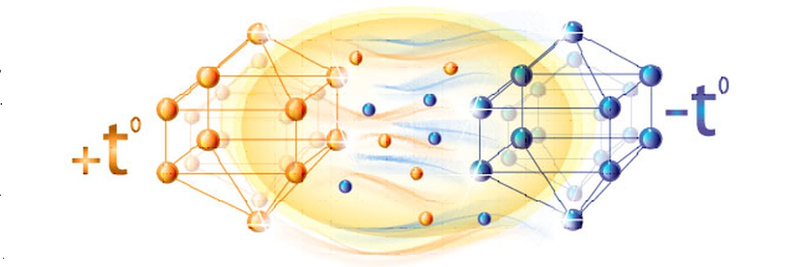

# Thermodynamics

Библиотека `thermodynamics` предоставляет собой набор функций для термодинамических расчётов: газодинамические функции, свойства рабочих тел, параметры стандартной атмосферы, теплофизические свойства веществ и расчёты процессов сжатия/расширения.



## Install

### Python
```bash
pip install --upgrade git+https://github.com/ParkhomenkoDV/thermodynamics.git@main
```

## Requirements

- `numpy` — для численных расчётов
- `scipy` — для интерполяции
- `mathematics` — для констант и параметров
